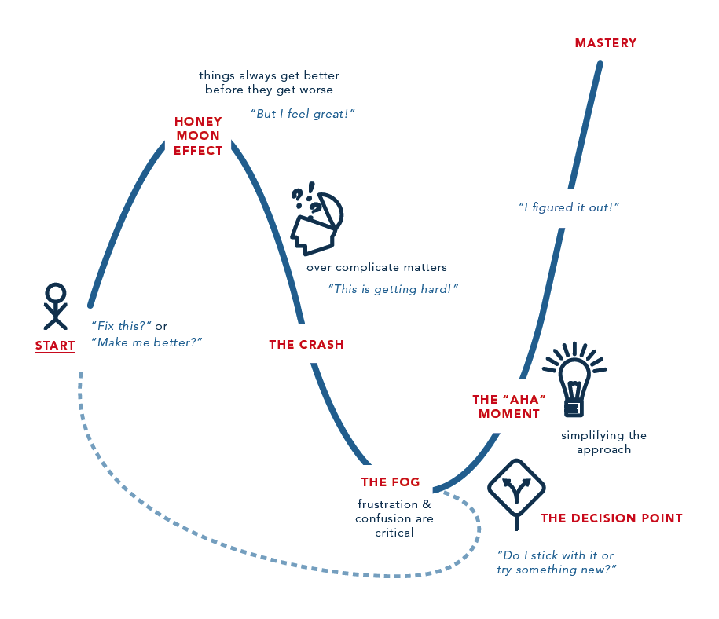

This is a personal space dedicated to the things that I adore,
that sparks joy so much in me that I can't stop talking about that I decided to vent anonymously.
And yes, those do include all the engineering hacks that I developed at work. :p

But on the other side of that joy, there are disappointment and frustration achieving mastery.
Look at this [5 step pathway to mastery learning curve](https://www.bhrettmccabe.com/blog/the-5-step-pathway-to-mastery):

Lot of the times, I am stuck at the global minimum and unable to accelerate myself out of it.
Hope this blogging exercise will make by turning point and spring me upwards.

Happy Learning!

